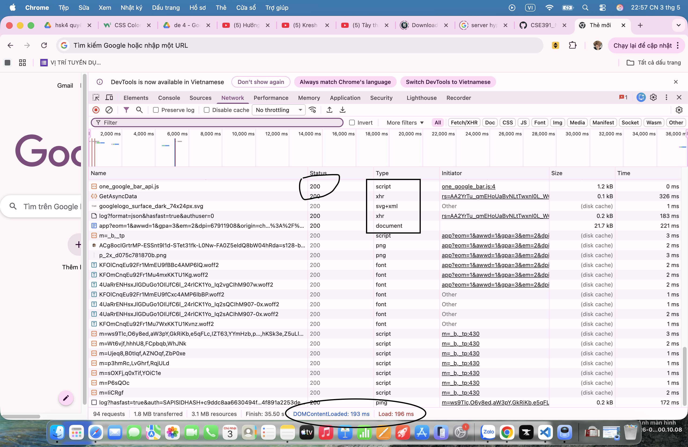
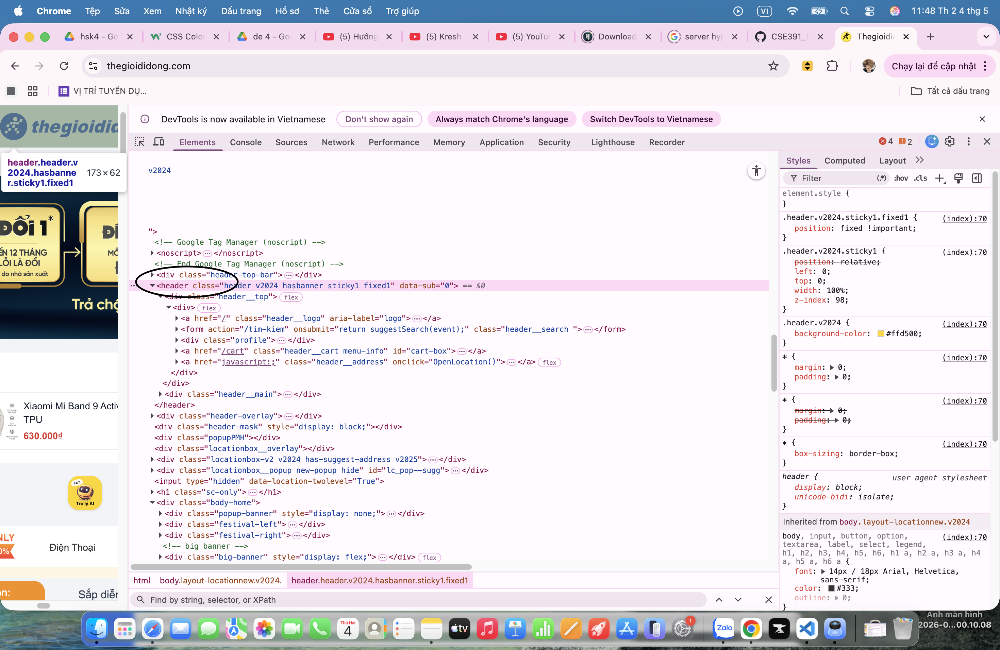
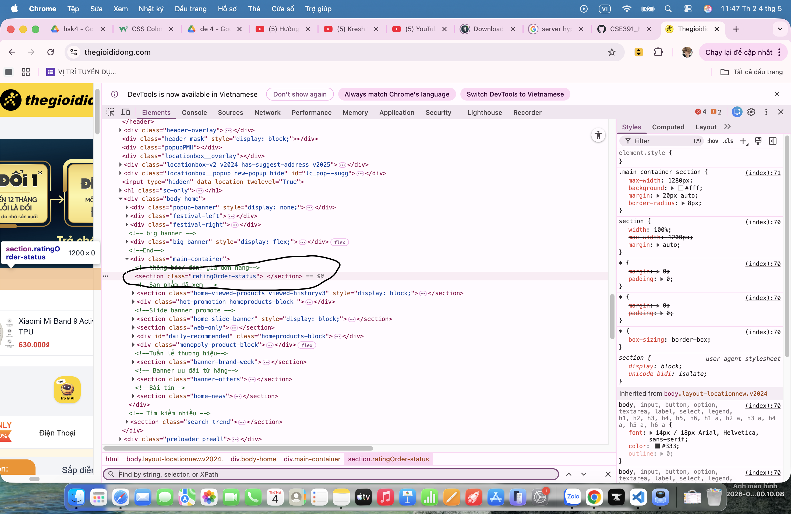
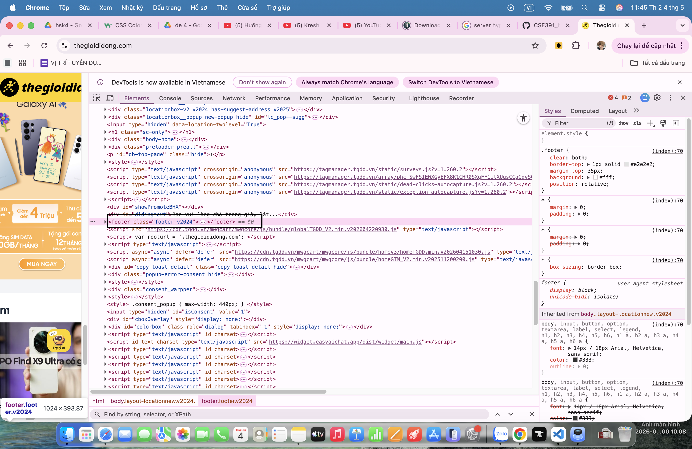
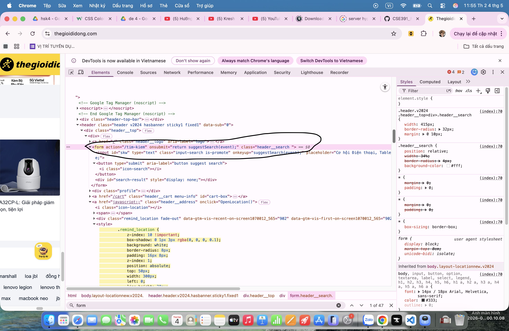

# Phần A
## Câu A1:
### Phần 1:Khi bạn gõ https://shopee.vn vào trình duyệt và nhấn Enter, hãy liệt kê đúng thứ tự ít nhất 5 bước xảy ra (từ DNS lookup đến render).
# Sau khi đọc (01_introduction_html_universe.md) em có thể rút ra 5 bước:
1. Request xuất phát từ laptop → đi qua router WiFi 
2. → Qua nhà mạng VNPT → chạy xuyên cáp quang dưới đáy Thái Bình Dương
3. → Đến data center của Shopee
4. → Server xử lý truy cập vào trang chủ shopee
5. → Response chạy ngược lại: cáp quang → VNPT → router → laptop
6. → Chrome nhận file HTML, CSS, JS → render ra giao diện shopee

### Phần 2:rong DevTools của Chrome, tab Network cho thấy thông tin gì? 

Tab NetWork: xem request/ reponses
Ví dụ: Thời gian load từng loại file, Dung lượng file, loại tài nguyên
Công dụng: khi Website tải chậm - file nào nặng nhất có thể dùng để chỉ ra lí do tại sao web chậm
 

## Câu A2:
```
<div class="header">
    <div class="logo">ShopTLU</div>
    <div class="menu">
        <div><a href="/">Trang chủ</a></div>
        <div><a href="/products">Sản phẩm</a></div>
    </div>
</div>
<div class="main">
    <div class="product">
        <div class="title">iPhone 16 Pro</div>
        <div class="price">25.990.000đ</div>
        <div class="image"></div>
    </div>
</div>
<div class="footer">© 2026 ShopTLU</div>
```
Trang web bị Google đánh giá SEO thấp vì chỉ sử dụng toàn thẻ <div>, gây khó hiểu do thiếu semantic:
4 lỗi semantic:
1. <div class="header"> Sửa thành <header>.
2. <div class="menu"> Sửa thành <nav>.
3. <div class="main"> Sửa thành <main>.
4. <div class="product"> Sửa thành <article> hoặc <section>.
5. <div class="footer"> Sửa thành <footer>.
 ## Câu A3
 ```
 <div>Hộp 1</div>
<span>Text A</span>
<span>Text B</span>
<div>Hộp 2</div>
<span>Text C</span>
<strong>Text D</strong>
<div>Hộp 3</div>
```
Hộp 1  
Text A Text B  
Hộp 2  
Text C Text D  
Hộp 3  
Giải thích: bởi vì thẻ ```<div>``` là thẻ block nên luôn chiếm hết dòng thẻ ```<span>``` và thẻ ```<strong> là thẻ inline nên sẽ nằm cùng một dòng

## Câu A4
1. Khác nhau giữa <thead>, <tbody>, <tfoot>:

<thead>: Chứa các hàng tiêu đề của bảng.

<tbody>: Chứa các hàng dữ liệu chính.

<tfoot>: Chứa các hàng tổng kết, tính toán hoặc ghi chú.

2. 3 lý do KHÔNG NÊN dùng table để tạo layout:

-Sai ngữ nghĩa (Semantic): Gây nhầm lẫn cho các công cụ đọc màn hình và ảnh hưởng xấu đến SEO.

-Không Responsive: Cấu trúc hàng,cột cứng nhắc, rất khó để tối ưu giao diện trên thiết bị di động.

-Code phức tạp, khó bảo trì: Tạo ra cấu trúc HTML lồng nhau quá sâu (tag soup), việc thêm/bớt thành phần rất dễ làm vỡ toàn bộ layout.

# Phần C

## Câu C1 — Thiết kế cấu trúc
Bạn được giao thiết kế cấu trúc HTML cho trang chi tiết sản phẩm (giống trang sản phẩm Shopee/Tiki). Trang bao gồm:  
Header + Navigation  
Breadcrumb (Trang chủ > Điện thoại > iPhone 16)  
Khu vực ảnh sản phẩm (5 ảnh)  
Thông tin sản phẩm (tên, giá, đánh giá sao, mô tả)  
Bảng thông số kỹ thuật  
Khu vực đánh giá/bình luận  
Sidebar: Sản phẩm tương tự  
Footer  
Yêu cầu: Viết chỉ phần cấu trúc HTML (không cần nội dung thật, chỉ cần đúng thẻ và nesting). Mỗi thẻ phải có comment giải thích tại sao bạn chọn thẻ đó.  

```html
<!DOCTYPE html>
<html lang="vi">
<head>
    <meta charset="UTF-8"> <!-- hỗ trợ tiếng Việt -->
    <meta name="viewport" content="width=device-width, initial-scale=1.0"> <!-- responsive -->
    <title>Chi tiết sản phẩm</title>
</head>

<body>

    <!-- HEADER -->
    <header> <!-- header: phần đầu trang -->
        <div class="logo">ShopTLU</div> <!-- logo -->
        
        <nav> <!-- nav: khu vực điều hướng chính -->
            <ul> <!-- ul: danh sách menu -->
                <li><a href="/">Trang chủ</a></li>
                <li><a href="/products">Sản phẩm</a></li>
            </ul>
        </nav>
    </header>

    <!-- BREADCRUMB -->
    <nav aria-label="breadcrumb"> <!-- nav: điều hướng -->
        <ol> <!-- ol: có thứ tự -->
            <li><a href="/">Trang chủ</a></li>
            <li><a href="/phones">Điện thoại</a></li>
            <li>iPhone 16</li> <!-- item hiện tại -->
        </ol>
    </nav>

    <!-- MAIN CONTENT -->
    <main> <!-- main: nội dung chính của trang -->

        <!-- KHU VỰC SẢN PHẨM -->
        <section class="product-detail"> <!-- section: nhóm nội dung sản phẩm -->

            <!-- ẢNH SẢN PHẨM -->
            <section class="product-images"> <!-- section: nhóm ảnh -->
                <h2>Hình ảnh sản phẩm</h2> <!-- heading cho SEO -->
                
                <figure> <!-- figure: chứa ảnh -->
                     <!-- alt: SEO + accessibility -->
                </figure>

                <figure>
                    
                </figure>

                <figure>
                    
                </figure>

                <figure>
                    
                </figure>

                <figure>
                    
                </figure>
            </section>

            <!-- THÔNG TIN SẢN PHẨM -->
            <article class="product-info"> <!-- article: nội dung độc lập (1 sản phẩm) -->
                
                <h1>iPhone 16 Pro</h1> <!-- h1: tiêu đề chính -->

                <p class="price">25.990.000đ</p> <!-- p: văn bản -->

                <div class="rating"> <!-- div: nhóm đánh giá -->
                    ★★★★☆ (100 đánh giá)
                </div>

                <section class="description"> <!-- section: mô tả -->
                    <h2>Mô tả sản phẩm</h2>
                    <p>...</p>
                </section>

            </article>

        </section>

        <!-- BẢNG THÔNG SỐ -->
        <section class="specs"> <!-- section: nhóm thông số -->
            <h2>Thông số kỹ thuật</h2>

            <table> <!-- table: dữ liệu dạng bảng -->
                <thead> <!-- thead: tiêu đề bảng -->
                    <tr>
                        <th>Thông số</th>
                        <th>Chi tiết</th>
                    </tr>
                </thead>

                <tbody> <!-- tbody: dữ liệu chính -->
                    <tr>
                        <td>Màn hình</td>
                        <td>...</td>
                    </tr>
                </tbody>

                <tfoot> <!-- tfoot: tổng kết -->
                    <tr>
                        <td colspan="2">Thông tin chỉ mang tính tham khảo</td>
                    </tr>
                </tfoot>
            </table>
        </section>

        <!-- ĐÁNH GIÁ / BÌNH LUẬN -->
        <section class="reviews"> <!-- section: nhóm đánh giá -->
            <h2>Đánh giá khách hàng</h2>

            <article class="review"> <!-- article: mỗi review độc lập -->
                <p>Người dùng A: Sản phẩm rất tốt</p>
            </article>

            <article class="review">
                <p>Người dùng B: Đáng mua</p>
            </article>
        </section>

    </main>

    <!-- SIDEBAR -->
    <aside> <!-- aside: nội dung phụ (sản phẩm liên quan) -->
        <h2>Sản phẩm tương tự</h2>

        <article class="related-product"> <!-- mỗi sản phẩm -->
            <p>iPhone 15</p>
        </article>

        <article class="related-product">
            <p>Samsung S24</p>
        </article>
    </aside>

    <!-- FOOTER -->
    <footer> <!-- footer: chân trang -->
        <p>© 2026 ShopTLU</p>
    </footer>

</body>
</html>
```


## Câu C2: Một đồng nghiệp nói: "Dùng ```<div>``` cho mọi thứ rồi thêm class là được, không cần semantic HTML. Tốn thời gian học thêm thẻ mới." Viết 1 đoạn phản biện (200-300 từ), phải bao gồm: Ít nhất 2 lý do kỹ thuật (SEO, Accessibility) 1 ví dụ cụ thể chứng minh semantic HTML giúp ích 1 trường hợp thực tế mà ```<div>``` vẫn phù hợp

Ý kiến “dùng div cho mọi thứ rồi thêm class là được” nghe có vẻ nhanh nhưng về lâu dài là không hợp lý. Thứ nhất là về SEO. Công cụ tìm kiếm như Google không nhìn giao diện mà đọc cấu trúc HTML. Khi sử dụng các thẻ semantic như header, main, article, h1, Google có thể hiểu đâu là nội dung chính, đâu là tiêu đề quan trọng. Nếu chỉ dùng div, trang web sẽ thiếu ý nghĩa về mặt cấu trúc và dễ bị đánh giá thấp hơn.

Thứ hai là về khả năng truy cập. Các công cụ hỗ trợ như screen reader cho người khiếm thị dựa vào semantic HTML để đọc trang. Ví dụ, thẻ nav giúp người dùng di chuyển nhanh giữa các menu, thẻ main giúp bỏ qua phần header để vào nội dung chính. Nếu toàn bộ chỉ là div thì trải nghiệm sử dụng sẽ kém hơn rất nhiều.

Một ví dụ cụ thể là trang chi tiết sản phẩm. Nếu tiêu đề dùng h1 và nội dung nằm trong article, Google sẽ hiểu đây là phần quan trọng của trang và ưu tiên hiển thị khi tìm kiếm. Đồng thời người dùng sử dụng screen reader cũng dễ dàng nắm được cấu trúc nội dung.

Tuy nhiên, div vẫn có vai trò riêng. Nó phù hợp khi cần nhóm các phần tử để phục vụ cho việc layout hoặc styling bằng CSS, đặc biệt khi không có thẻ semantic nào mô tả chính xác mục đích đó.

Tóm lại, semantic HTML không phải là tốn thời gian mà là cách viết code rõ ràng, dễ hiểu và thân thiện hơn với cả công cụ tìm kiếm lẫn người dùng.

# Liệt kê lỗi của bài B3
Lỗi 1: Dòng 1 — <!DOCTYPE> sai chuẩn — Sửa thành ```<!DOCTYPE html> ```   
Lỗi 2: Dòng 3 — Thiếu đóng thẻ ```<title>``` — Thêm ```</title>```  
Lỗi 3: Dòng 4 — charset viết sai "utf8" — Sửa thành "UTF-8"  
Lỗi 4: Thiếu meta viewport — Thêm:  
```<meta name="viewport" content="width=device-width, initial-scale=1.0">```  
Lỗi 5: Dòng 8 — ```<h1>``` không đóng đúng — Sửa thành ```<h1>...</h1>``` 
Lỗi 6: Dòng 12 — Thẻ ```<a>``` không đóng — Sửa thành ```</a>```  
Lỗi 7: href="home" sai semantic link nội bộ — Sửa thành href="#home"  
Lỗi 8: Dòng 19 — `````` thiếu dấu ngoặc kép và alt — Sửa:  
``````  
Lỗi 9: Dòng 21 — Sai thứ tự đóng thẻ ```<b>``` — Sửa thành:  
```<strong>25.990.000đ</strong>```  
Lỗi 10: Không dùng thẻ semantic cho ảnh — Bọc bằng:  
```<figure> + <figcaption>```  
Lỗi 11: Bảng thiếu ```<thead>``` và ```<tbody>``` — Thêm vào  
Lỗi 12: Dùng ```<td>``` thay vì ```<th>``` cho header — Sửa thành <th>  
Lỗi 13: Có 2 thẻ ```<main``` — Sai semantic — Đổi cái thứ 2 thành ```<aside>```  
Lỗi 14: Dòng cuối — ```<p>``` không đóng — Thêm ```</p>```  
Lỗi 15: Thiếu thuộc tính lang trong``` <html>``` — Thêm lang="vi"  

# Bài B4: Phân tích thegioididong.com
1. 
Thẻ Senmatic header


Thẻ Senmatic section


Thẻ Senmatic footer


2. 
Không thể tìm thấy thẻ table 

3. 
Thẻ form 

input type được dùng là kiểu text

## Phần D:
máy em lỗi obs không quay được ạ, mong thầy thông cảm!